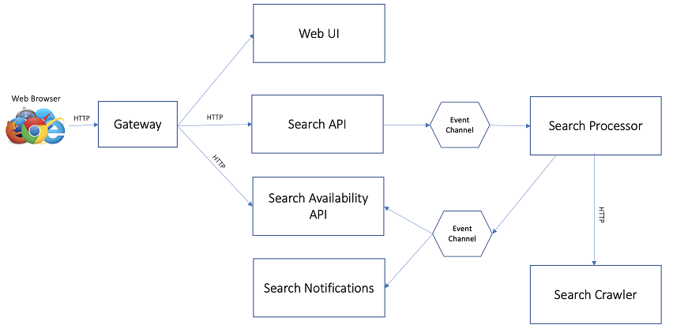

# Hungryman
The hungryman dining search solution is a multi micro-service application that implements a relatively contemporary architecture comprised of the following technologies:

* ReactJS Web Front End
* Reactive REST Web Services (WebFlux)
* Reactive Database Access (R2DBC)
* Asynchronous Message (Spring Cloud Streams)
    * RabbitMQ Binding
* Spring Data (Redis)

In addition to Spring Cloud Stream, CloudEvents and KNative eventing are supported as an alternative deployment option with a small change in application dependencies (but no source code changes).  This alternative deployment method also supports the KNatvie scale to zero implementation as well as auto scaling. 

The default application configuration supports static out of the box data sets; however, is also options to configure alternative data sources.  Lastly, the asynchronous messaging model supports the ability to add applications to the extend functionality.

## Use Case
The value proposition of the Hungryman application is to search for availability at dining establishments.  Unlike other search applications that provide on-demand results of dining availability in real time, Hungryman attempts to ease the frustration of obtaining reservations at establishments that are have limited availability (i.e. they are hard to get into).  Real time searches at these types of establishment tend to always show no availability and forces a user to either continually hit the `search` button or come back to the reservation site multiple times to check if availability has opened.  This is wear Hungryman steps in; it takes a set of search parameters such a time windows, establish name, establishment type, and/or zip code and continually searches for availability on the users behalf.  The user can come back at a later time and check to see what availability the application has found.  Hungryman continues searching and updating availability results as they change.  A real time notification module can also be added that sends real time notifications to a user over a configured medium.

## Application Architecture

Hungryman consists of fore main service modules:

* A web UI written in ReastJS (`hungryman-ui`)
* An API service for submitting search requests (`hungryman-search`)
* A `processor` service for executing searches again availability sources and managing results (`hungryman-search-proc`)
* An API service that stores and provides access to availability results

Hungryman also has two optional components.

* A crawler service that collects establish availability and provides a query API (`hungrman-crawler`)
* A real time notification service that publishes availability to configured destination (`hungryman-notifiy`)

The high level data flow looks like the following:

Note that the event channel protocols are not specified as they can be swapped out with different implementations.  By default, the application uses the RabbitMQ binding for spring cloud streams, but could be swapped for any supported binding.  Because the channel end points are implements as Java `functions`, they are support `CloudEvents` and the event channels can be orchestrated through other mechanisms such as KNative eventing.  As you will see later on, there are provided deployment configurations in this repository for RabbitMQ service binding and KNative eventing.

## Deployment

All services in the Hungryman application can technically be deployed on almost any Java enabled platform (thank you Spring).  Below are detailed deployment instructions for various platforms:

* Tanzu Application Services (TBD)
* [Tanzu Application Platform](doc/TAPDeployment.md)

